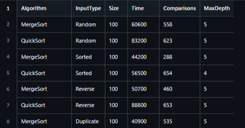
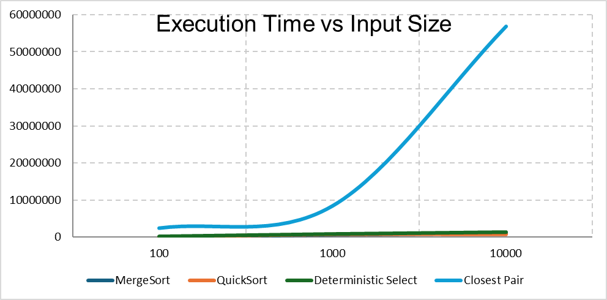
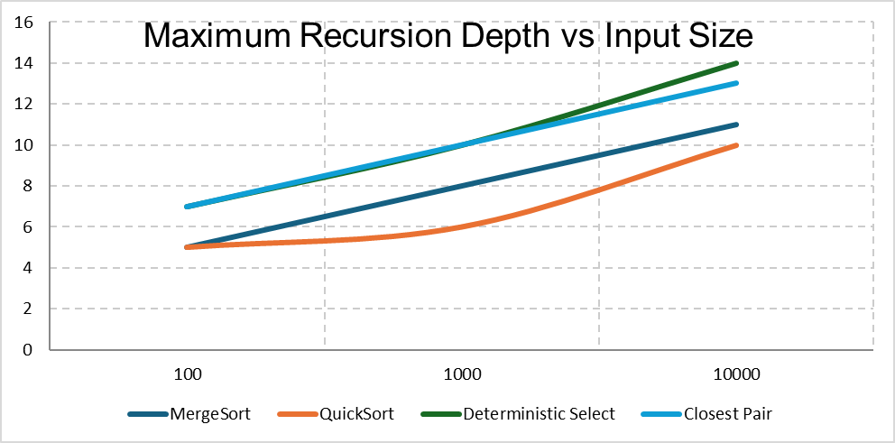
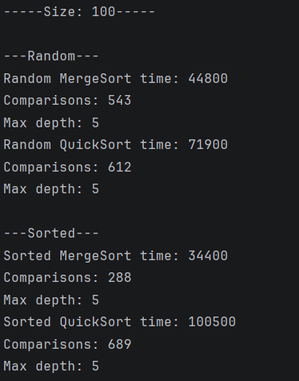
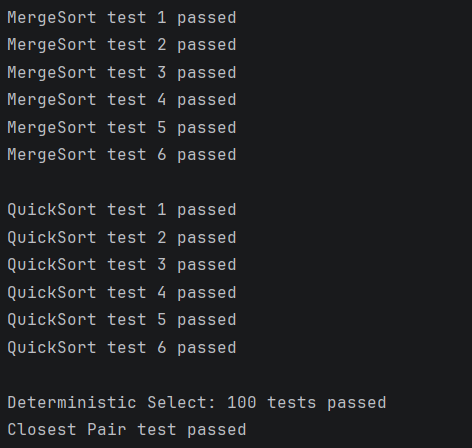

# Assignment 1
## A. Project Overview

The purpose of this assignment is to implement and analyze divide and conquer algorithms in Java.

Implemented algorithms:
- Merge Sort
- Quick Sort
- Deterministic Selection
- Closest Pair of Points

## B. Algorithms Analysis

### Merge Sort

Merge Sort divides the array into two parts , sorts them recursively and merges them.

For small arrays , Insertion sort is used with cutoff = 10.

**Time Complexity:** O(n log n)
**Space Complexity** O(n)

**Recurrences**
T(n) = 2T(n/2) + O(n)
Using the Master Theorem:
O(n log n)

### Quick Sort 
Quick Sort selects a random pivot and divides the array around the pivot.

**Average Time:** O(n log n)  
**Worst Time:** O(n²)  
**Space Complexity:** O(log n)

T(n) = 2T(n/2) + O(n)

Result:

O(n log n)

### Deterministic Selection

Deterministic Selection finds the k-th smallest element.

It divides elements into groups of 5 and uses the Median of Medians as a pivot.

**Time Complexity:** O(n)  
**Space Complexity:** O(log n)

**Recurrence:**

T(n) = T(n/5) + T(7n/10) + O(n)

Using Akra-Bazzi intuition:

O(n)

### Closest Pair of Points

Closest Pair finds the minimum distance between two points.

**Time Complexity:** O(n log n)  
**Space Complexity:** O(n)

**Recurrence:**

T(n) = 2T(n/2) + O(n)

Using the Master Theorem:

O(n log n)

## C. Experimental Results

The algorithms were tested with:

- n = 100
- n = 1000
- n = 10000

Sorting algorithms were tested on:

- Random
- Sorted
- Reverse-sorted
- Duplicate-heavy

Measured values:

- Execution time
- Comparisons
- Maximum recursion depth

Full results are stored in:

`results/results.csv`

### Time vs. n

### Recursion Depth vs. n

## D. Discussion

### Do the results match theoretical complexity?

Yes. When the input size increases, the algorithms need more time.

### How does input structure affect performance?

Merge Sort works almost the same with different input types.

Quick Sort can work slower with many duplicate values.

### Why does smaller-first recursion help QuickSort?

It helps reduce recursion depth.

### Why does Median-of-Medians guarantee O(n)?

It chooses a good pivot and removes many elements in each step.

### Why is Closest Pair faster than O(n²)?

Brute force checks every pair of points.

Divide-and-conquer checks fewer points, so it is faster for large inputs.

### Practical Factors

Execution time can also be affected by:

- CPU cache
- Memory
- Background programs

## E. Reflection

This assignment helped me understand divide-and-conquer algorithms better. I learned how recursion, partitioning, and merging work in real Java programs.

## F. Screenshots

### Program Output

### Test Results

### Plots

